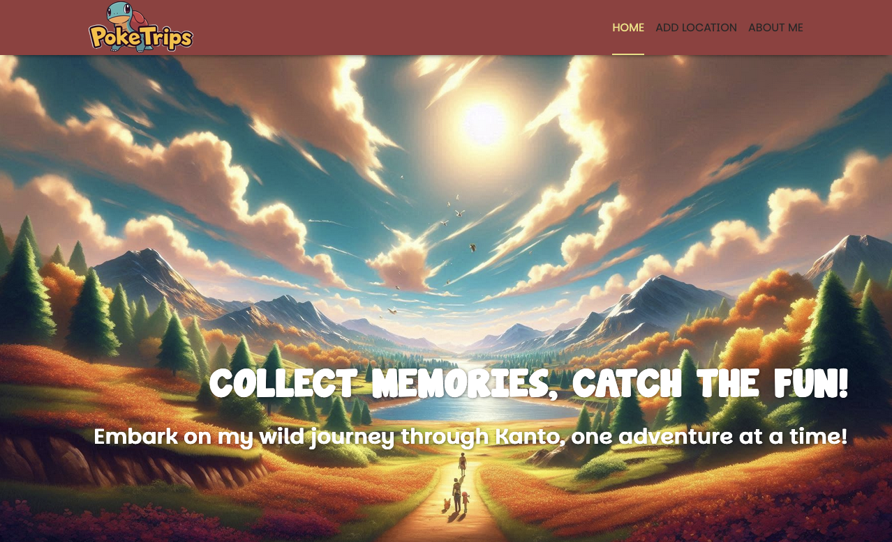

# PokeTrips 🐾

Welcome to **PokeTrips**, a travel blog that takes you on a journey through the first-generation Pokémon region, Kanto! This project showcases a series of fictional travel blogs describing trips around iconic locations in Kanto, blending Pokémon with real-world geography.



## Prerequisites

Before getting started, ensure that you have the following tools installed:

- **Node.js** (v14 or higher): You can download it from [Node.js Official Website](https://nodejs.org/).
- **npm** (Node Package Manager): This is bundled with Node.js. Make sure it’s up to date by running `npm install -g npm`.

## Getting Started

Follow these instructions to set up **PokeTrips** on your local machine.

### 1. Clone the Repository
Clone this repository to your local machine using the following command:
```bash
git clone https://github.com/vsilvabruno/PokeTrips.git
cd PokeTrips
```

### 2. Install Dependencies

In the root directory of the project, run the following command to install all necessary packages:

```bash
npm install
```

### 3. Start the Development Server

To view the project locally, run:

```bash
npm run dev
```

This will start the frontend in development mode and open it in your browser at the local link shown on your terminal.

### 4. Enjoy the Blog!

Once the server is up and running, you can begin exploring the **PokeTrips** blog. Navigate through different regions and posts related to the Pokémon Kanto journey.

---

## Features

* **Blog Posts**: Each post details a different trip to Kanto’s iconic locations, such as Pallet Town, Cerulean City, and the Pokémon League.
* **Interactive Maps**: The Kanto region map features interactive markers highlighting each destination mentioned in the blog posts. The coordinates on the map are approximations of the real-world locations in Kanto, Japan.
* **AI-Generated Images**: All images featured in the blog posts are AI-generated using [Microsoft Designer](https://designer.microsoft.com/), bringing the Kanto region and Pokémon world to life.

---

## Credits

* **Images**: All images were generated with the help of [Microsoft Designer](https://designer.microsoft.com/).
* **Kanto Region Inspiration**: The Kanto region featured in this project is inspired by the first-generation Pokémon games and the real-world Kanto region in Japan.

---

Enjoy your adventures with **PokeTrips** and explore the Kanto region like never before!
